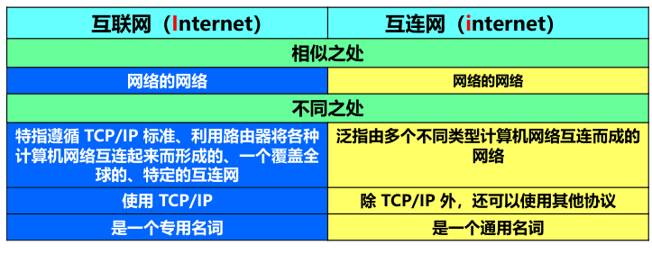

# 概述

## 互联网概述

1.基本概念

- 网络（计算机网络）：节点 （计算机、集线器、路由器、交换机）+ 链路

- 互连网（网络的网络）internet：通用名词，指多个网络通过路由器互连形成的网络

- 互联网Internet：专有名词，特指全球最大的特定互连网，采用TCPIP通信协议

- 主机：接入网络的计算机

- 互联网服务提供者ISP：如中国电信、中国移动等

- 互联网交换节点IXP：使得两个网络可以直接相连并交换分组，地区ISP、本地ISP无需经过上一级ISP来交换分组。

- 内容提供者：在互联网上对所有用户提供视频文件的公司，直接与各ISP相连

  

- 万维网WWW：互联网的一部分，互联网的革命性创新，产生了“超链接”“浏览器”“搜索引擎”的概念使得互联网得以广泛被非网络专业人员使用，无需通过IP地址、Unix命令等知识，使互联网从需要专业知识查找信息的“散乱的书库”，变成了任何人都可以通过点击链接查找资料的“有编目的图书馆”。

2.互联网的发展历程

- 前身：APARNET，美国单个分组交换网（并非互连网）

- 第一阶段：发展为互连网，多种网络互连

- 第二阶段：形成三级结构的互联网。美国政府资助->私人公司运营的NSFNET，主干网，地区网，校园网（企业网），

- 第三阶段：全球范围多层次ISP结构的互联网：NSFNET被多个商用互联网主干网替代。

- 至此，互联网形成了三层ISP结构，主干ISP-地区ISP-本地ISP。用户上网通过向ISP缴纳入网费用，得到 ISP 从互联网管理机构申请到的IP地址，通过连接本地ISP接入互联网

  

## 互联网组成

### 边缘部分（通信和资源共享）

1.定义：所有连接到互联网上的主机。用户直接使用。

2.端系统之间的两种通信方式：两个主机之间的通信实质上是**主机的进程之间的通信**

1. 客户-服务器C/S方式：（浏览器-服务器属于C/S的一种特例）

   1. 定义:客户、服务器都是通信涉及到的两个进程

   2. 客户请求服务器提供服务

   3. 客户特点：知道服务器地址、不需要特殊硬件和复杂操作系统

   4. 服务器特点：同时处理多个请求、一直运行且无需知晓客户地址、强硬件与高级操作系统

      

2. 对等连接P2P方式：

   与C/S类似，只是不区分服务器与客户，每个主机都安装了对等连接软件，都可以作为服务请求方和服务提供方

   

### 核心部分（连通和交换）

1.定义：由大量网络和路由器组成。

2.三种交换方式：（转发分组是核心部分最重要的功能）

1. 电路交换

   1. 源于电话通信

   2. 建立连接 -- 通话  -- 释放连接

   3. 特点：通话的全部时间内，通话的两个用户都始终占用端到端的通信资源。

      ​			因而不适合传输计算机数据，效率很低（计算机传输数据不需要一直占线，会极大浪费通信线路资源）

2. 报文交换

   略

3. 分组交换

   1. 特点

      1. 存储转发技术
      2. 分组（包）=  划分报文为等长数据段 + 含有地址等控制信息的首部（包头）
      3. 路由器：和主机一样是计算机，但用途是转发分组而不是处理信息
      4. 路由器转发过程：暂存 - 查表 - 转发

   2. 优点

      

   3. 问题

      1. 排队时延
      2. 首部（包头）带来的开销

4. 三者区别

   1. 转发过程

   

   ​	2.三者特点

   ​	⚫若要连续传送大量的数据，且其**传送时间远大于连接建立时间**，则电路交换的传输速率较快。

   ​	⚫ **报文交换和分组交换**不需要预先分配传输带宽，在传送**突发数据**时可提高整个网络的**信道利用率**。

   ​	⚫ 由于一个分组的长度往往远小于整个报文的长度，因此**分组交换**比报文交换的时延小，同时也具有**更好的灵活性**	

   

## 计算机网络的指标

### 性能指标

1. 速率bps 

2. 带宽bps：计算机网络中不指通频带宽度，指信道的**最高数据率**

3. 吞吐量bps：单位时间通过网络的**实际**数据量

4. 时延

   1. 发送时延：=数据帧长/发送速率
   2. 传播时延：=距离/电磁波速度
   3. 处理时延
   4. 排队时延

5. 时延带宽积：以比特为单位的链路长度

6. 往返时间RTT：从发送端发送完数据，到发送端接收到接收端的确认信号

7. 利用率：D = D0/（1-U），时延D与信道利用率U的关系

8. 注意：当提及**传输速率**时：Mbps指的是10^6bit/s , 此时前缀字母k/M/G均为**（10^3）的幂次**

   ​			当提及**数据存储**时：Mb = 2^20bit,kB = 8kb = 2^13bit，此时前缀字母k/M/G均为**(2^10)的幂次**

### 非性能指标

费用 质量 标准化 可靠性 可拓展性可升级性 易于维护和管理

## 网络体系结构

1. 层次化网络协议：
   1. 优点：各层独立、灵活性好、各层可分开、易于维护
   2. 缺点：降低效率、各层功能可能重复
2. 对等层：在层次化结构中处于同一层的协议
3. 实体、协议、服务、服务访问点：协议是两个对等实体的水平通信的规则，实现协议需要使用的实体下一层提供的服务，相邻两层交互的接口为服务访问点
4. 协议是水平的，同一层实体间通信的用的
5. 服务是垂直的，下一层的协议为上一层的协议提供的支持。

   

   

   