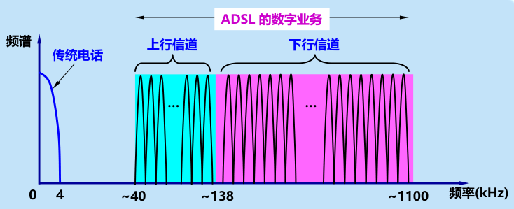

# 物理层

## 1.基本概念及需要重温的部分知识

1. 物理层的主要任务：确定与传输媒体的接口有关的特性：

   1. 机械：引脚数等
   2. 电气：电压范围
   3. 功能：电平意义
   4. 过程：时序意义

2. 数字通信系统模型

   

3. 编码方式

   1. 归零/不归零

   2. 曼彻斯特

   3. 差分

      
## 2.物理层下的传输媒体

### 导引型传输媒体（有线传输）

1. 双绞线

   1. 特点：
      - 最常使用，电话系统几乎都是双绞线，局域网中也大量使用
      - 通信距离：十几公里， 随线径、信号频率影响
      - 带宽：随绞合度、屏蔽层等因素变化，从十几兆到到几百兆带宽，8类双绞线甚至可达两千兆
   2. 专有名词：STP（屏蔽双绞线）、UTP（无屏蔽双绞线）
   3. 图例

   

   

2. 同轴电缆

   1. 主要用于有线电视网的居民小区

   2. 特点

      1. 抗干扰强

      2. 带宽可达1GHz，由同轴线缆质量决定

      3. 阻抗匹配：50Ω——LAN/数字传输常用

         ​					75Ω——有线电视/模拟传输常用

   3. 图例

      

3. 光缆

   1. 特点

      1. 带宽高得离谱，可达上万GHz
      2. 传输损耗小，通信距离长得离谱
      3. 抗雷电和电磁干扰强(绝缘介质）
      4. 重量体积小
      5. 无传音干扰（光信号与绝缘介质）

   2. 多模光纤与单模光纤

      单模光纤是指光纤线径接近电磁波波长（微米级），使之不发生反射

      

4. 架空明线（已基本不用）

### 非导引型传输媒体（自由空间、无线传输）

1. 特点

   

2. ISM（工、科、医）——可自由使用的频段之一

   其中无线局域网常用2.4GHz和5.8GHz这两个频段

## 3.信道复用技术

1. 共享信道：降低成本（少拉缆线），提高利用率

2. 频分复用FDM/FMDA

   1. 相同时间，不同数据/用户占用不同频段

   2. **区分**：FDM和FMDA，FD是指频分复用；M是指复用技术，MA是指多址接入，后者专指频分复用于不同用户使用，前者未指明，也可能是用于同一用户，但不同频段的数据代表不同的含义。

      时分复用和码分复用的M和MA也是一样的道理。

3. 时分复用TDM/TMDA

   1. 不同数据/用户占用不同时间间隙用相同的频带

   2. 图例

      

      每个TMD帧，不同用户占用不同序号的时隙，则每个用户的信号周期性出现

   3. 统计时分复用STDM——改进信道利用率

      1. 原因：TMDA技术没有考虑计算机数据的突发性，导致信道有很多空闲时间被浪费

      2. 改进点：STDM 帧不是固定分配时隙，而是按需动态地分配时隙。

      3. STMD帧的构成特点：

         1. 时隙数小于用户数
         2. 集中器按用户顺序（ABCD）扫描各用户输入
         3. 有输入就放入帧中

      4. 对比图

         

         

4. 波分复用WDM（光信号的频分复用）（光纤）

   1. 数量概念

      1. 带宽：密集波分复用（DWDM）可复用几十路光载波信号，每一路信号的数据率40Gbps,则光纤数据率可达2.56Tbps

         ​			而一根光缆往往有上百根光纤，数据率以 Tbps 为量级

      2. 传输距离：光纤放大器之间的传输距离为120km

   2. 图例

      

5. 码分复用CDM/CDMA（扩频技术一种）

   1. 各用户挑选不同的码型，各码型在解调中不会相互干扰
   
   2. 码片序列：将每比特时间划分为m个短的间隔（码片），不同的码片序列$\vec{S}$​应当相互正交，即
   $$
      $$\vec{S}\cdot\vec{T}=\frac{1}{m}\sum_{i=1}^{m}S_iT_i=0
   $$
      而相同用户的码片相同，与相同码片内积的结果为1，与其反码内积的结果为-1。
   
   3. 工作原理示意：
   
      
   
      则积分完是 0 —— 无比特 ，1 ——比特1 ， -1——比特0

## 4.宽带接入技术（接入网）
### 1.ADSL（非对称数字用户线路）——电话线基础上改造

   1. 概念：ADSL是对模拟电话线改造，使0-4kHz的频段留给电话，往上的可用通带留给用户上网；而非对称指的是用户上行频段远小于下行频段带宽

   2. 图例

      

      使用频分复用技术，在不同频段上并行传输数据，每个带宽约4kHz

   3. 实际上，ADSL并没有改变用户线，而是在用户线的基础上添加了调制解调器，使数字信号调制为可以在用户线上传输的模拟信号
### 2.光纤同轴混合网（HFC）——有线电视网技术上改造

   1. 示意图

      

      2.特点

      1. 有线电视网的单向变为双向传输

      2. 带宽千兆

      3. 电缆调制解调器，仅用户端，因为共享电缆信道，所以使用HFC的电缆调制解调器上网受这段电缆有多少用户同时接入网络

         特点是传输速率高，可达30Mbps

      4. UIB用户接入盒，接入网示意图

         提供一下三种连接方式

         运营商核心网
         │
         ├───HFC光纤干线
         │   │
         │   └───光节点（光纤转同轴）
         │       │
         │       **├──同轴电缆→UIB→机顶盒→电视机（电视业务）**
         **│       │**
         **│       ├──同轴电缆→UIB→电缆调制解调器→计算机（互联网业务）**
         **│       │**
         **│       └──双绞线→UIB→电话机（电话业务）**

         总结：UIB是用户侧的“多业务网关”，通过同轴电缆、双绞线等介质，将电视、电话、互联网分配到对应终端。

         ​			实现“一线到户，多业务共存”
### 3.FTTx技术（光纤到x）

   1. x

      

   2. 无源光配线网ODN

      

