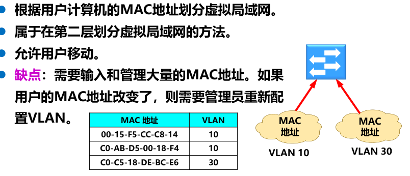

# 数据链路层

**研究内容**：数据链路层研究的是在局域网中，将分组从一个主机转发到另一个主机，其中不经过路由器转发（只在一个局域网中，不经过其他的网络）

**两种信道**：数据链路层研究的范围不涉及路由器转发，仅研究局域网中，节点到节点的数据分组传输。

而在同一个局域网中，有两种信道，点对点信道和广播信道（共享信道）

## 1.共同问题

1. 数据链路和帧的概念

   1. 链路：物理链路    **数据链路**：链路 + 协议（硬件软件）

      举例：电脑通过以太网接入家庭路由器，那么电脑与路由器之间的双绞线（物理链路）+  以太网协议(数据链路层协议) 构成这电脑与家庭路由器两个节点之间的数据链路

   2. 帧：帧 = 首部（包头） +  网络层的IP数据报（分组/包）+  尾部（包尾） 

2. **三个基本问题**

   1. 封装成帧

      即添加首部尾部

      作用：帧定界

      

      定界符：利用ASCII码表中的控制字符

      

   2. 透明传输——使数据链路层对数据传输来说像透明不存在一样（具体指数据不会被误识别为帧定界）

      错误情况：没有转义字符，不能不关注数据中有没有定界符，可能错误划分帧

      

      正确情况：采用字节填充/比特填充，使得数据中一定不包含定界符，无需关心数据，数据链路层对数据就像不存在

      1. 字节填充：

         1. 发送端：将数据中的出现定界符SOH前加上转义字符ESC，并将原定界符转为别的字符（如PPP协议加/减去0x20）

         2. 接收端：将接收到的转义字符删去，并将后面的字符（定界符）转为原来的字符（如PPP协议减/加0x20）

            

      2. 比特填充 见PPP协议

   3. 差错检测

      1. 比特差错

         **循环冗余检错CRC**

         1. k比特**数据**

         2. （n+1）比特**除数**（协议事先商定好）

         3. **运算**：数据  除以 除数（模二运算）

         4. **余数：n比特FCS码**

            

      2. 帧差错

         1. 帧重复、帧丢失、帧失序

      3. 注意：可靠传输要保证以上两个差错不出现

         ​			 无比特差错  ≠ 无传输差错

## 2.点对点协议PPP(点对点信道)

1. 应用场景：接入网

   

2. PPP协议的特点

   1. PPP协议满足的需求
      1. **简单**——首要要求
      2. 封装成帧
      3. 透明性——异步传输（字节填充）同步传输（比特填充）
      4. 支持多种网络协议——往上层的接口
      5. 支持多种链路——往下的接口
      6. 差错检测——对帧检测
      7. 检测连接状态
      8. 最大传输单元
      9. 网络层地址协商
      10. 数据压缩协商
   2. PPP协议不具备的
      1. 纠错
      2. 流量控制
      3. 序号
      4. 多点线路
      5. 半双工或单工链路
   3. PPP协议的组成
      1. 将IP数据报封装到串行链路的方法
      2. 链路控制LCP
      3. 网络控制NCP

3. PPP协议的帧格式

   1. 图例

      

   2. 首部：四个字段

      1. **标志字段**0x7E,帧定界
      2. 地址字段0xff，无意义
      3. 控制字段0x03，无意义
      4. **协议字段**，指明信息部分的种类

   3. 信息部分：IP数据报/网络控制数据/PPP链路控制数据/鉴别数据

   4. 尾部：两个字段

      1. 纠错控制序列
      2. 标志字段：帧定界

4. 数据透传——主要任务是剔除信息字段中的帧定界符与控制字符

   1. 异步传输（逐字节陆续传送）——字节填充
      1. 发送端，信息字段中的：
         1. 小于0x20的控制字符A（可选）——0x7D(转义字符)  + (A + 0x20)
         2. 大于0x20的控制字符B（即转义字符0x7D与帧定界符0x7E）—— 0x7D(转义字符)  +  (B - 0x20) 
      2. 接收端，与上述相反：去掉转义符，根据转义字符后的字符大小，变换回原字符，若还是转义字符，再变换
   2. 同步传输（一连串比特连续传送）——比特填充
      1. 发送端：检测信息字段是否有连续的5个1，有则立即填入一个0
      2. 接收端：检测信息字段是否有连续的5个1，有则删去后面的一个0
   3. 字节填充vs比特填充
      1. 字节填充更灵活，除了针对帧定界符，还可拓展其他控制字符，但效率较低
      2. 比特填充效率较高，但只针对帧定界符

5. PPP协议只保证无比特差错传输，而不使用序号和确认机制的可靠传输的原因

   1. 在数据链路层**出现差错的概率不大时**，使用比较简单的 PPP 协议较为合理。

   2. 在因特网环境下，PPP 的信息字段放入的数据是 IP 数据报。数据链路层的可靠传输并不能够保证网络层的传输也是可靠的。

   3. 帧检验序列 **FCS 字段可保证无差错接受**。

6. PPP协议的工作状态

   1. 图例

      

   2. 状态转换

      1. 链路静止-- 建立物理层链路：如用户拨号连接ISP路由器
      2. 建立LCP链路
         1. 配置PPP协议：最大帧长、是否使用PPP的地址字段和控制字段、鉴别协议等
         2. 鉴别：鉴别通信发起方身份
      3. 网络层协商，建立NCP链路
         1. 配置IP地址：ISP动态分配IP地址给用户，以便网络层协议可以正常运行
      4. 链路终止
      5. 不同状态下使用的不同协议，体现在PPP帧的协议字段。例如，当建立LCP链路，使用LCP协议，协议字段为0xC021,信息字段内容为配置/回应LCP链路配置的内容

## 3.使用广播信道的数据链路层（CSMA/CD协议）

### 基础知识

1. 局域网技术（约等于以太网 + WIFI（无线版本以太网））

   1. 局域网跨越了数据链路层和物理层

   2. 局域网的特点

      1. 网络为**一个单位所拥有**；
      2. 地理范围和站点数目均**有限**。

   3. 局域网的优点

      1.具有**广播功能**，从一个站点可很方便地访问全网。局域网上的主机可共享连接在局域网上的各种硬件和软件资源。

      2.便于系统的扩展和逐渐地演变，各设备的位置可灵活调整和改变。

      3.提高了系统的可靠性、可用性和残存性

   4. 拓扑结构

      

   5. 传输媒介

      

2. 共享信道（广播信道）所需要考虑的问题：多设备共享信道而不相互干扰

   解决方案：

   1. 静态划分信道：TDMA/FDMA/CDMA/WDMA
   2. 动态媒体接入：**随机接入**（以太网——碰撞检测）、受控检测（令牌环局域网——多点轮询）后者基本被淘汰
   
3. 网络适配器（网卡）

   作用：串并转换、缓存、实现以太网协议

   注意：需要在计算机上安装适当的设备驱动程序管理网卡，管理网卡收发、读写数据

   

### （重点）CSMA/CD协议——载波监听/碰撞检测

1. 适配器的**过滤功能**：数据帧中包含的目的地址与适配器中ROM存储的硬件地址（MAC地址）一致（或广播地址或多播地址）时，适配器才接收这个帧

2. 以太网采取的简便通信措施

   1. 无连接工作方式。即不事先建立连接就直接发送数据，不用像PPP协议、TCP协议先握手建立连接再发送数据。数据的收发基于数据帧的MAC寻址，数据的检测纠错基于高层协议（如TCP）。

      1. 不编号
      2. 不要求确认回传——纠错交给高层协议 因为局域网信道质量好，因信道产生差错概率小

      所以，以太网提供的是**不可靠的交付**，而且引出一个问题——**协调总线上各计算机的工作**

   2. 曼彻斯特编码——便于同步，不过带宽翻倍

3. **CSMA/CD协议**

   

   1. 多点接入——总线网络

   2. 载波监听——边发送边监听，事实上没有载波，载波指的是通信载体（信道），因此实际意思是**信道监听**。

      等信道上空闲再发送。

   3. **碰撞检测**

      1. 检测到碰撞：适配器边发送数据边检测到信道上信号电压变化幅度超过门限，判为发生碰撞
      2. 检测到碰撞后：正在发送数据的站停止发送，等待**随机时间**（退避算法）后再次发送。

   4. 碰撞后**退避算法**

      1. 争用期：总线最远端到端往返时延 2τ。经过争用期还没有碰撞，才能判定不会发生碰撞

      2. 最短有效帧长：由于争用期的存在，发送帧长小于“以太网数据率 × 争用期”的帧，都有碰撞产生无效帧而发送站无法检测的风险。  因此，将“以太网数据率 × 争用期”作为最短帧长。

         PS：事实上，以太网规定最短帧长为64字节（512b），这是基于早期共享介质（**半双工**）的以太网协议计算得来，往后采用交换式**全双工**已经无需碰撞检测，但为了协议兼容，还是有最短帧长64字节。

      3. 退避算法

         1. 退避时间单位——争用期

         2. 退避时间倍数r:

            r ∈ {0,1,2，……，（2^k  - 1）}

            k = Min[重传次数，10]

         3. 重传次数达到16，丢弃该帧并向高层协议汇报

      4. 强化碰撞

         

         正在发送数据的A、B站检测到碰撞，发送32b/48b的干扰信号，通知所有站点，信道发生碰撞。

         所以，信道被占用的时间为 TB + TJ + τ （A发送到检测到碰撞 + 干扰信道发送时长 + 最长传播时长τ）

   5. 总结：

      

### 使用集线器的星型拓扑

1. 集线器：集线器内部将所有端口的发送（TX）和接收（RX）线对**直接短接**，形成共享总线。——所以仍是半双工、采用CSMA/CD
2. 优点：价格低廉、便于管理

### 以太网的信道利用率

极限信道利用率：$S_{max} = \frac{T_0}{T_0 + \tau} = \frac{1}{1+a}$

其中T0为发送帧长时间，2τ为争用期，a表示传播时延占用的信道资源，帧长越长，这种占用的影响就越小

### 以太网的MAC层

1. MAC层的硬件地址——主机中适配器的唯一标识        [跳转MAC地址详解](https://blog.csdn.net/Cassiel_Paris/article/details/106896495)

   
   
   1. MAC地址：固化在适配器ROM中的48位全球地址，其中前3字节为IEEE注册管理机构分配给不同公司（需购买），后3字节由厂家自行指派，需不重复。
2. I/G位：单站/组地址，第一字节最低位，
   3. G/L位：全球/本地管理，第一字节倒数第二位
4. 去掉IG、GL位，仍有2^46超过70万亿个全球MAC地址供使用
   5. 发往本站的帧
   1. 单播
      2. 多播
   3. 广播
   6. 混杂方式

2. MAC帧的格式（以太网V2）

   

   1. MAC层帧格式
      1. 目的地址
      2. 源地址
      3. 类型：上层协议
      4. 数据
      5. FCS
   2. 物理层：添加同步码（因为9.6us的帧间隙）
      1. 前同步码：比特同步
      2. 帧开始定界符
   3. 无效MAC帧：无效则丢弃，重传由上层协议决定
      1. 数据段长度与长度字段的值不一（IEEE802.3格式，类型字段在小于0x0600时，表示数据字段长度）
      2. 帧长非整数字节
      3. FCS有误
      4. 有效MAC帧长在64—1518之间（数据字段46-1500），符合以太网对最短帧长的规定
   4. IEEE802.3的不同
      1. 长度/类型字段在小于0x0600时，表示数据字段长度，大于则表示类型
      2. 当“长度/类型”字段值小于 0x0600 时，数据字段必须装入上面的逻辑链路控制 LLC 子层的 LLC 帧。

## 4.扩展的以太网

### 物理层拓展

1. 采用光纤拓展——扩展物理覆盖范围（集线器覆盖100m内，光纤拓展到几公里外）

   

2. 采用集线器拓展——多级星型拓扑

   

   1. 优点：扩大通信范围
   2. 缺点：碰撞域增大，吞吐量不变；各碰撞域数据率必须一致，否则不兼容

### 数据链路层拓展——交换机拓展

1. 网桥与交换机

   1. 网桥：对mac帧过滤转发，根据目的地址决定转发/丢弃
   2. 交换机：多端口的网桥，全双工并行

   

2. **以太网交换机的特点**

   1. 每个接口都是一个碰撞域

      

   2. 接口有缓存

   3. 即插即用，帧交换表自学习建立

   4. 专用交换芯片，硬件快速转发，远超软件转发的网桥

   5. 性能远超集线器，价格低廉

3. **以太网交换机的优点**

   1. 用户独享接口，**总带宽增加**

      

      这是因为集线器本质上还是一个共享总线，N个用户均分总线带宽

      ​				交换机本质上为每个端口（用户）提供一条独享全双工线路，若每条线路的带宽与集线器总线带宽一致，则交换机的带				宽扩展N倍

   2. 从共享总线以太网转到交换式以太网时，所有接入设备的软件和硬件、适配器等都不需要做任何改动。

      这是因为物理层接口、上层协议不变，而交换机也只是将原本的大碰撞域变为了只有一个用户的独立碰撞域，对终端设备来说，只是没有冲突了，所以无需改动，以太网的“升级无需革命”理念

   3. 以太网交换机一般都具有多种速率的接口，方便了各种不同情况的用户。

   4. 以太网交换机的**自学习功能**——只记录“主动发送过帧的源 MAC 地址与接收端口”的映射

   5. 一开始转发表为空

   6. 交换机检测某接口接收到的帧并转发

      1. 源地址：交换表有则更新接口，无则添加接口对应源地址
      2. 目的地址：交换表无则广播转发，有则按交换表对应接口转发（除非该接口与帧进入的接口一致则丢弃）

   7. 流程图

      

   8. 生成树协议：切断某些链路，使得一台主机到所有主机的路径都是无环路的树状结构

4. 从总线以太网到星型以太网

   1. 总线型：半双工、使用CSMA/CD协议
   2. 星型：全双工、不使用CSMA/CD协议（没有碰撞了），但仍使用以太网帧结构

### 虚拟局域网（VLAN）

1. 原因/背景：广播风暴、保密分组

2. 虚拟局域网其实只是局域网给用户提供的一种服务，而并不是一种新型局域网。

   只是对局域网资源在逻辑上的整合划分。

3. 划分虚拟局域网的方法

   1. **基于交换机端口（物理层）**——静态配置

   2. 基于MAC地址（L2）

      

   3. 基于协议类型（MAC帧的类型字段，L2）

   4. 基于IP子网类型（L3）

   5. 基于高层应用（L4）

   6. 基于802.1Q**以太网帧格式拓展——增加VLAN标识**（2字节）（L2）——动态配置

      

略