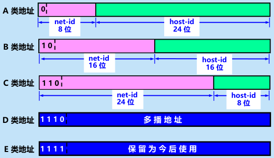
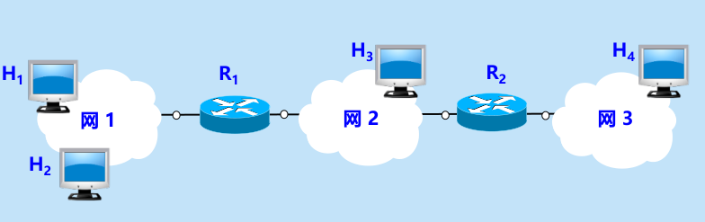
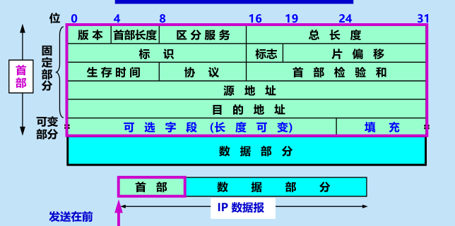
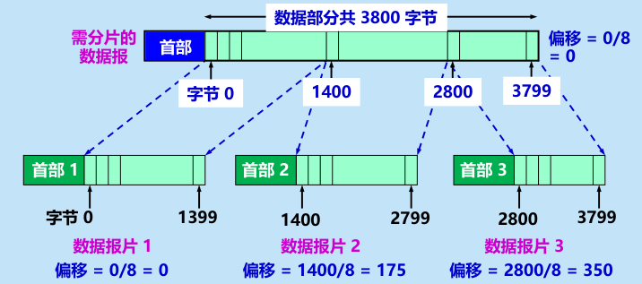
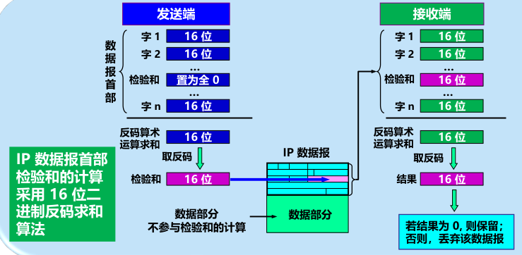

# 网络层

## 1.互联网提供的两种服务

1. 虚电路服务

2. **数据报服务**——更适合智能的主机，即网络不提供可靠交付

   

## 2.网际协议IP(IPv4)

1. IP地址及其表示方法

   1. IP地址：为连接到互联网的**每个主机**的**每个接口**分配的**32位**（IPv4）标识符

   2. 点分十进制：

   3. 两级结构：网络号+主机号

      
      
   4. 区分于MAC地址：mac地址为**硬件地址**，且MAC地址仅在局域网中有效；

      ​								IP地址为**逻辑地址**，在全球范围内有效，且分级易于查找，且可动态分配

2. 分类IP地址（早期）

   1. 分为五类地址

      

   2. 一般不指派的特殊IP地址

      

3. **无分类编址CIDR**

   1. 网络号→网络前缀 ：不定长
   2. 固定分类→地址块：更灵活
   3. 地址掩码（子网掩码）：用于查看网络前缀位数

4. IP地址特点：

   1. **分级结构**：
      1. 分配地址两级分配，机构分配网络号（地址块）+ 单位分配主机号
      2. 方便路由转发：路由器只需根据网络号转发，减少转发表内存和转发时间
   2. 标记**主机**和链路**接口**：多归属主机、路由至少两个IP（两个接口）
   3. 同一个网络前缀视为同一个子网：在IP地址的观点，互联网就被划分为不同子网
   4. 不同网络号间，互联网同等对待，相当于不同的子网相互平等

5. **地址解析协议ARP**

   1. 作用：查找同一局域网内IP地址的MAC地址的映射

   2. 高速缓存cache：主机中的”通讯录“——记录局域网内各IP与MAC地址的映射（有生存时间TTL，过了就得重新广播找）

      1. 存放最近获得的 IP 地址到 MAC 地址的映射，以减少 ARP 广播的数量。

   3. ARP请求分组与ARP响应：

      1. 请求：向局域网内广播“IP地址XXX主机B的MAC地址是多少？有知道的告诉IP地址YYY（自己）和MAC地址ZZZ（自己）的主			机A”
      2. 响应：同个局域网的主机B收到，向主机A单播“IP地址XXX主机B的MAC地址是KKK”

   4. ARP四种情况：

      1. 主机H1→主机H2（同局域网）：请求分组，找到主机B的MAC地址，记录在A的高速缓存

      2. 主机H1→主机H3（不在同局域网）：请求分组，无响应，交给路由器R1（以下3.4.）

      3. 路由器R1→主机H3（R1同局域网，与A不同）：请求分组，找到主机C的MAC地址，记录在R1的高速缓存

      4. 路由器R1→路由器R2（主机H4与R1不在同局域网）：请求分组，无响应，交给路由器R2（重复3.4.）

         

6. **IP数据报结构**

   

   1. 首部

      1. 固定字段（固定20字节）

         1. 版本号        4位

         2. 首部长度    4位

         3. 区分服务	2字节（没卵用）

         4. 数据报总长度   2字节 ：当超过L2的MTU时需要**分片**

         5. 标识       2字节：每个IP数据报都有一个标识，分片后，具有相同标识的报片恢复为原来的数据报

         6. 标志       3位：

         7. 片偏移   13位：标记报片在报文中相对于起点的位置（以8字节为单位）

            

            

         8. 生存时间TTL  1字节：跳数限制

         9. 协议 1字节：数据使用的上层协议

         10. **首部检验和**  2字节：检验数据报首部反码和是否一致

             1. 首部划分为16位一组（检验和字段置零），组间反码求和，填入检验和字段
             2. 接收端也反码求和，得出结果为0则保留数据报

             

         11. **源地址**  4字节IP地址

         12. **目的地址** 4字节IP地址

      2. 可选字段

   2. 数据字段

7. **IP层转发分组的流程**

