# 网络层

## 1.互联网提供的两种服务

1. 虚电路服务

2. **数据报服务**——更适合智能的主机，即网络不提供可靠交付

   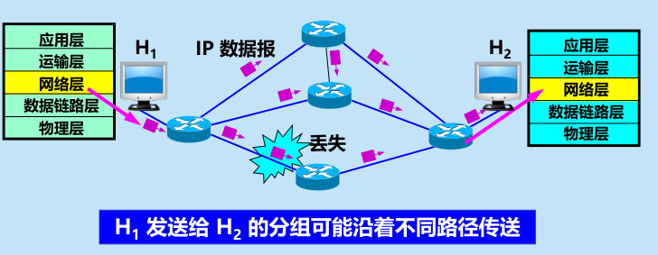

## 2.网际协议IP(IPv4)

### IP地址及其表示方法

1. IP地址：为连接到互联网的**每个主机**的**每个接口**分配的**32位**（IPv4）标识符

2. 点分十进制：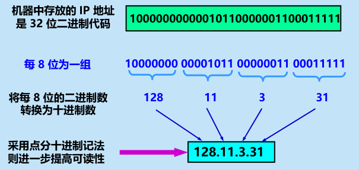

3. 两级结构：网络号+主机号

   
   
4. 区分于MAC地址：mac地址为**硬件地址**，且MAC地址仅在局域网中有效；

   ​								IP地址为**逻辑地址**，在全球范围内有效，且分级易于查找，且可动态分配

#### 1.分类IP地址（早期）

1. 分为五类地址

   

2. 一般不指派的特殊IP地址

   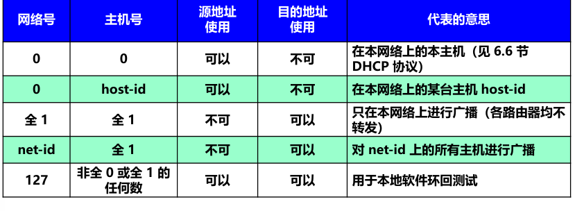

#### 2.**无分类编址CIDR**

1. 网络号→网络前缀 ：不定长

2. 固定分类→地址块：更灵活

3. 地址掩码（子网掩码）：用于查看网络前缀位数

4. **路由聚合**：一个 CIDR 地址块可以表示很多地址，这种地址的聚合常称为路由聚合

5. 举例：

   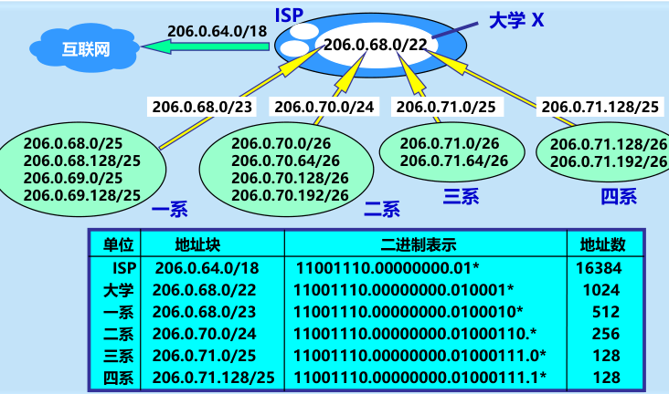

   在这个例子中，ISP拥有地址块206.0.64.0/18（地址数2^14 相当于64个C类网络），并划分地址块206.0.68.0/22给某大学（4个C类网络），大学还可以自主划分地址块给各院系。

   |                       | 不采用CIDR                    | 使用CIDR后                            |
   | --------------------- | ----------------------------- | ------------------------------------- |
   | 外网转发到该ISP的路由 | 最少64条（64个C类网络地址块） | 路由聚合，只需要一条路由206.0.64.0/18 |
   | ISP转发到该大学的路由 | 最少4条（4个C类网络地址块）   | 路由聚合，只需要一条路由206.0.68.0/22 |

   可见CIDR通过更灵活的子网划分方法，不仅**方便地址分配**，更**减轻了路由器转发的压力**（大大减少了路由转发表的大小）

#### 3.IP地址特点

1. **分级结构**：
   1. 分配地址两级分配，机构分配网络号（地址块）+ 单位分配主机号
   2. 方便路由转发：路由器只需根据网络号转发，减少转发表内存和转发时间
2. 标记**主机**和链路**接口**：多归属主机的路由至少两个IP（两个接口）
3. **同一个网络前缀 = 同一个子网 = 一个或多个局域网通过交换机相连形成的局域网**：在IP地址的观点，互联网就被划分为不同子网
4. 不同网络号间，互联网同等对待，相当于不同的子网相互平等

### **地址解析协议ARP**

1. 作用：查找同一局域网内IP地址的MAC地址的映射

2. 高速缓存cache：主机中的”通讯录“——记录局域网内各IP与MAC地址的映射（有生存时间TTL，过了就得重新广播找）

   1. 存放最近获得的 IP 地址到 MAC 地址的映射，以减少 ARP 广播的数量。

3. ARP请求分组与ARP响应：

   1. 请求：向局域网内广播“IP地址XXX主机B的MAC地址是多少？有知道的告诉IP地址YYY（自己）和MAC地址ZZZ（自己）的主			机A”
   2. 响应：同个局域网的主机B收到，向主机A单播“IP地址XXX主机B的MAC地址是KKK”

4. ARP四种情况：

   1. 主机H1→主机H2（同局域网）：请求分组，找到主机B的MAC地址，记录在A的高速缓存

   2. 主机H1→主机H3（不在同局域网）：请求分组，无响应，交给路由器R1（以下3.4.）

   3. 路由器R1→主机H3（R1同局域网，与A不同）：请求分组，找到主机C的MAC地址，记录在R1的高速缓存

   4. 路由器R1→路由器R2（主机H4与R1不在同局域网）：请求分组，无响应，交给路由器R2（重复3.4.）

      

### **IP数据报结构（IPv4）**

1. 首部

   - 固定字段（固定20字节）

      1. 版本号        4位

      2. 首部长度    4位

      3. 区分服务	2字节（没卵用）

      4. 数据报总长度   2字节 ：当超过L2的MTU时需要**分片**

      5. 标识       2字节：每个IP数据报都有一个标识，分片后，具有相同标识的报片恢复为原来的数据报

      6. 标志       3位：

      7. 片偏移   13位：标记报片在报文中相对于起点的位置（以8字节为单位）

         

         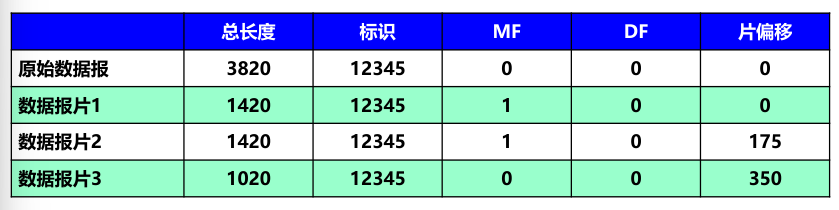

      8. 生存时间TTL  1字节：跳数限制

      9. 协议 1字节：数据使用的上层协议

      10. **首部检验和**  2字节：检验数据报首部反码和是否一致

          1. 首部划分为16位一组（检验和字段置零），组间反码求和，填入检验和字段
          2. 接收端也反码求和，得出结果为0则保留数据报

          

      11. **源地址**  4字节IP地址

      12. **目的地址** 4字节IP地址

   - 可选字段  

2. 数据字段

## 3.**IP层转发分组的流程**

1. **基于终点**——总思路

   > IP层是网际协议，只需**交付到局域网**，局域网内的交换机就会将数据报交付目的主机
   >
   > 因此，IP层做的实际上是不断匹配目的IP的前缀，直至找到目的子网

   目的IP --> 转发表 --> 下一跳路由器 

2. 最长**前缀匹配**——判断下一跳的方法

   - 原因：

     不同子网的网络前缀必然不同，但形式上（不计算掩码）可能相同。

     这是因为聚合后的网络前缀地址块，不一定包含地址块中的所有子网。

     举例：

     |                    | 子网1         | 子网2         |                          |
     | ------------------ | ------------- | ------------- | ------------------------ |
     | 外网转发表中的路由 | 128.1.24.0/24 | 128.1.24.0/22 | 形式相同                 |
     | 包含子网：         | 128.1.24.0/24 |               | 子网2不包含128.1.24.0/24 |
     |                    |               | 128.1.25.0/24 |                          |
     |                    |               | 128.1.26.0/24 |                          |
     |                    |               | 128.1.27.0/24 |                          |

     因而需要最长前缀匹配

   - 路由匹配

     - 匹配方法

       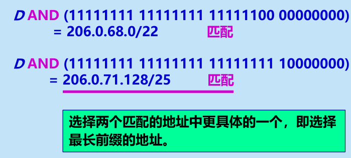

       

     - 特别路由

       - 主机路由：为特定目的主机定制的路由 a.b.c.d/32
       - 默认路由：转发表没有匹配路由，走此路由0.0.0.0/0

   - 路由器转发具体方法：

     1. 提取目的IP
     2. 若有该IP的主机路由，直接转发
     3. 若无主机路由，从最长前缀开始匹配，一匹配到就转发
     4. 若无匹配路由，转发到默认路由，若无默认路由，则报错

3. **二叉**线索**查找**——压缩路由查找时间

   1. 原因：直接逐行匹配效率太低，因为要对目的IP从32位前缀到1位前缀逐行查找

      > 时间复杂度O(n)，随转发表的大小线性增大

   2. 解决方法：唯一前缀。生成路由表每一个路由IP的唯一前缀（唯一前缀就少很多位数），并将目的IP与唯一前缀匹配，若匹配则再匹配网络前缀

   3. 唯一前缀匹配方法：二叉线索

      

      > 时间复杂度：O(1)，肯定能在32次查找以内（往往远小于32次）找到唯一前缀（没找到也说明不在该转发表内）

## 4.网际控制报文协议ICMP

1. 目的：

2. 报文格式

   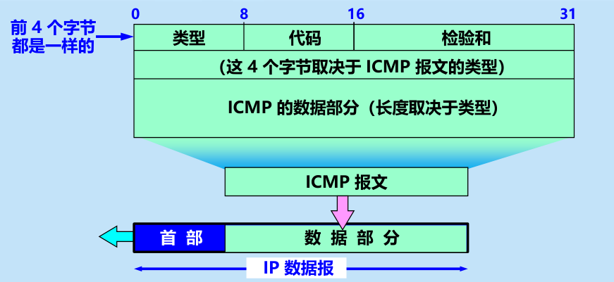

   作为IP数据报的数据部分，即ICMP报文 + IP首部 = IP数据报

3. 报文类型

   1. ICMP 差错报告报文

      -  终点不可达
      -  时间超过
      -  参数问题
      -  改变路由（重定向）(Redirect)

      - 数据字段

        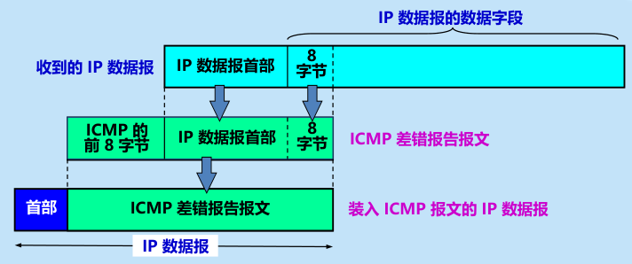

        ​	将产生差错的IP数据报的首部 + 数据字段前8字节作为ICMP的数据部分。

      - 不应发送ICMP差错报文的情况

        - 差错报文产生差错
        - 第一个分片报文的后续分片
        - 多播地址/特殊地址的报文

   2.  ICMP 询问报文

      1. 回送请求或回送回答——PING
      2. 时间戳请求或时间戳回答

## 5.IPv6

- 主要变化 		IPv4 -->IPv6

  - 更大地址空间。32 -->  **128位**

  - 数据报结构

    - （**首部 + 数据）-->（固定的基本首部 + 有效载荷（扩展首部 + 数据））**

      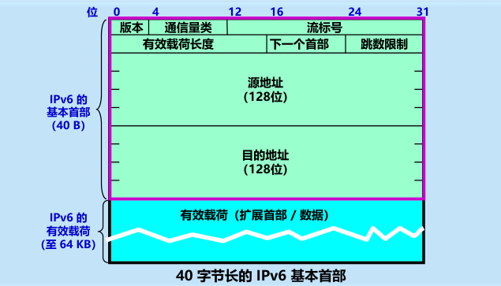

  - 精简首部

    - 长度**固定** (20~60)-->**40字节**
    - 取消或更改若干字段，字段数精简至8个
      - 其中增加了流标号
      - 取消了总长度、标识标志片偏移等，放在了扩展首部
      - 增加下一个首部，用于指示扩展首部，相当于协议字段（无扩展）或可选字段（扩展首部的类型）
      - 取消检验和，把可靠交付完全交给传输层
      - 总长度 --> 有效载荷长度（总长度 - 40）

  - 灵活的扩展首部

    IPv6 把原来 IPv4 首部中选项的功能都放在扩展首部中，并将扩展首部**留给路径两端**的源站和目的站的主机**来处理**

    这样大大提高了中间的路由器的处理效率（不用处理首部的选项了）

  - 即插即用（自动配置），**不需要DHCP**

  - 支持**资源预分配**

- 三种基本类型的地址

  - 单播
  - 多播（包括广播）
  - 任播（交给目的主机分组中最近的一个）

- 地址表示方法

  - 冒号十六进制
  - 0压缩

- IPv4过渡到IPv6

  - 隧道技术

    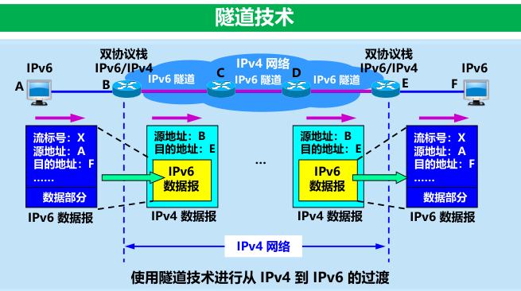

    在IPv4网络中，把IPv6报文当作IPv4报文的数据部分

  - 双协议栈

    使一部分**主机（或路由器）装有两个协议栈**，一个 IPv4 和一个 IPv6，和 IPv6 主机通信时是采用 IPv6 地址，而和 IPv4
    主机通信时就采用 IPv4 地址。根据 DNS 返回的地址类型可以确定使用 IPv4 地址还是 IPv6 地址

## 6.路由选择协议

### 分层次路由选择协议

分层次：

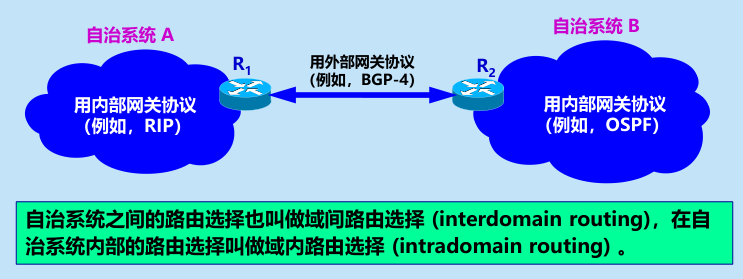

> 注：路由器 = 网关

原因：	1.不分层路由表太庞大，没法搞

​		    2.各单位（AS-自治系统）也不想内部细节被人所知，不想不分层

分类：

### 内部网关协议——RIP

1. 工作原理：选择距离向量最短的路由

   RIP只允许路径**最长距离为16**，**只适用于小型网络**

   > 距离：从一个路由器到直接连接的网络的距离定义为 1；距离 = 跳数

2. 特点

   1. who：仅与相邻路由器交换路由信息
   2. what：交换自己的路由表
   3. when：固定时间间隔交换

   使用**UDP报文**

   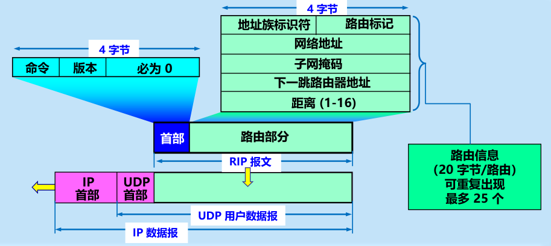

3. **算法**：

   1. 将相邻路由器X发来的路由表，“下一跳地址” --> X，距离 + 1

   2. 对比自己的路由表：

      1. 缺少到目的网络的路由，添加；否则2
      2. 原路由表有下一跳地址为X的路由，替换；否则3
      3. 距离减少，替换（距离不变则没必要换）；否则4
      4. 什么也不做

   3. 若3分钟（长时间）没有收到X的路由信息，标记X为不可达（距离为16）

      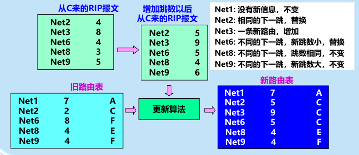

4. 缺点：好消息传得快，**坏消息传得慢**

   原因：网络故障时，路由器要等到距离增长到不可达才能发现

### 内部网关协议——OSPF

1. 工作原理：基于链路状态协议，建立共享同步的链路状态数据库（全网/AS的拓扑结构）

   > 相当于所有路由器共享并共同维护一张地图。
   >
   > OSPF 的更新过程收敛得快是其重要优点（RIP坏消息可能要数分钟，而OSPF对所有链路状态的更新，响应不超过100ms）

2. 特点：

   1. who：每个路由器都**向AS中所有其他路由器发送信息**（洪泛法）。

   2. what：发送信息为【与本路由器相邻的所有路由器的链路状态】。

      > 链路状态 = **下一跳**路由器 + 该条链路的**代价**
      >
      > 代价（度量）可以为距离、带宽、时延等信息

   3. when：当**链路状态发生变化**或间隔30min(长时间)，洪泛发送路由信息。

   > OSPF 的区域 ： 为了使 **OSPF 能够用于规模很大的网络**，OSPF 将一个**自治系统再划分**为若干个更小的范围，叫做区域
   >
   > 区域标识符：每一个区域都有一个 **32 位的区域标识符**
   >
   >  **主干区域**：其标识符规定为0.0.0.0。主干区域的作用是用来**连通其他在下层的区域**
   >
   > 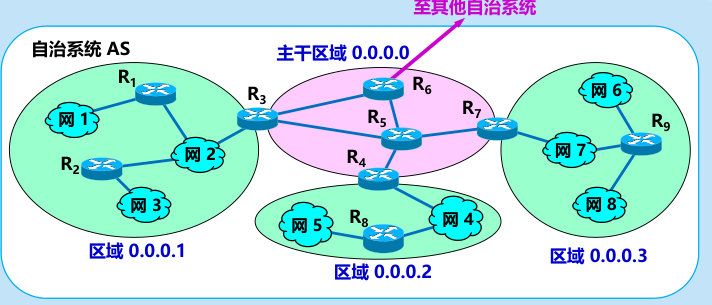
   >
   > 目的：将利用**洪泛法**交换链路状态信息的范围**局限于每一个区域**而不是整个的自治系统，这就减少了整个网络上的通信量
   >
   > 影响：**在一个区域内部的路由器只知道本区域的完整网络拓扑，而不知道其他区域的网络拓扑的情况**

3. 分组类型

   1. 问候分组：发现和维持邻站（相邻路由器）的**可达性**

   2. 数据库描述分组：给邻站**发送自己的链路状态数据库**摘要

   3. 链路状态请求分组：请求对方发送某些链路状态的详细信息

   4. **链路状态更新**分组：洪泛法向全网更新链路状态——核心

   5. 链路状态确认分组：对链路状态更新分组的确认

      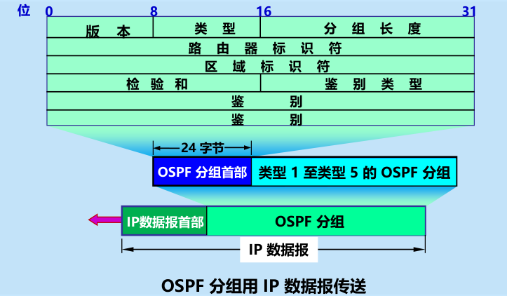

      > 1.OSPF 不用 UDP 而是**直接用 IP 数据报传送**，RIP报文用UDP报文
      >
      > 2.**多点接入**的局域网采用了**指定的路由器** (designated router) 的方法，使广播的信息量大大减少

4. 优点

   1. 通信量小：一个路由器的链路状态只涉及到与相邻路由器的连通状态，因而与整个互联网的规模并无直接关系。

      > 对比RIP协议，RIP协议中每个路由器都要**定时**交换**所有路由信息**，其通信量随网络规模（路由器数目）平方增长，
      >
      > 而OSPF只需要在**链路状态更新时**交换**相邻链路状态**，其通信量大大减小

   2. 响应快：OSPF 没有“坏消息传播得慢”的问题，据统计，其响应网络变的时间小于 100 ms

### 外部网关协议——BGP-4

1. 工作原理：基于路径向量路由选择协议

2. 环境特点：

   1. 不同AS之间的路由选择十分困难。代价无法对比、难以衡量。

      因此BGP协议**不寻找最佳路由**，而是较好路由。相邻AS交换的信息也是**可达性信息**。

   2. 路由选择仍需考虑策略。尽管不同AS的代价难以定量衡量，但可以定性判断，同时出于政治、信息安全等角度考虑，也可以选择更倾向的路由。

3. BGP路由

   1. 分类

      1. eBGP
      2. iBGP

   2. 交换路由信息

      先**建立 TCP 连接**，然后在此连接上交换 BGP 报文以建立 BGP会话(session)，利用 BGP 会话交换路由信息

      > BGP采用TCP报文传输，BGP会话是半永久连接，即交换完信息后仍保持TCP连接

   3. AS之间的关系

      邻站/对等（免费），穿越，末梢

   4. BGP路由选择策略

      1. 本地偏好值高优先，否则2
      2. AS跳数少优先，否则3
      3. 热土豆路由选择：尽快离开AS即可（考虑内部路由代价），不考虑是哪个eBGP路由，否则4
      4. BGP标识符最大的

   5. BGP四种报文

      - **打开**报文：用来与相邻的另一个BGP发言人**建立对等**（相邻）关系
      - **更新**报文：用来发送某一路由的信息，以及列出要撤消的多条路由
      - **保活**报文：确认打开报文和周期性地证实邻站关系
      - **通知**报文：发送检测到的差错

   6. 报文结构：采用**TCP报文传输**

      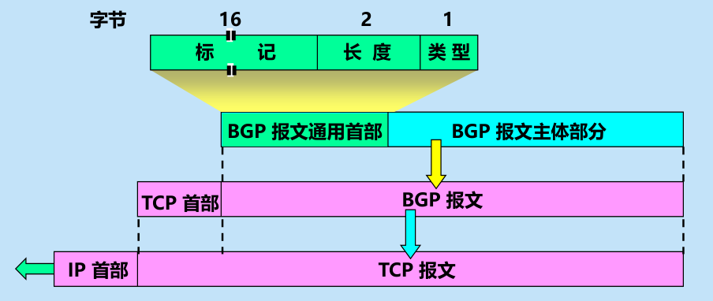

### 路由器结构

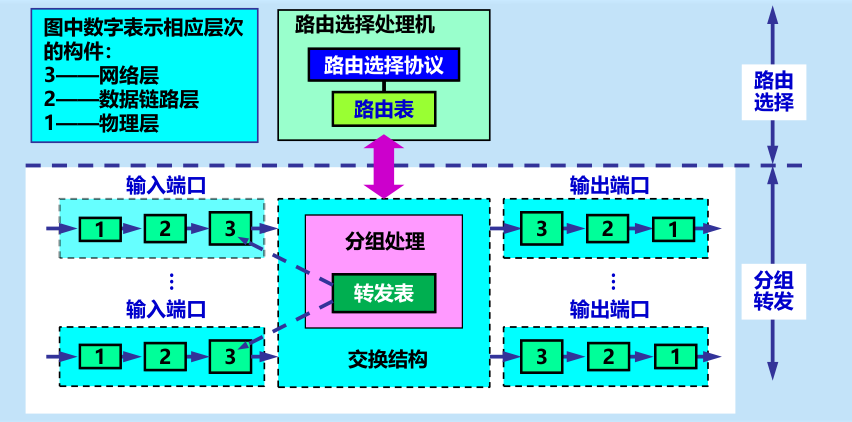

> ​	其中123 321表示分组首部的剥落和加装

1. 两部分：路由选择（控制）和分组转发部分

2. 分组转发部分

   1. 交换结构：根据转发表对分组进行处理，IO选择、分类输出（路由信息交付路由选择部分，数据则转发）

      - **常用交换方法**有三种：

        (1) 通过存储器

        (2) 通过总线

        (3) 通过纵横交换结构

   2. 输入端口：分组首部的剥落

      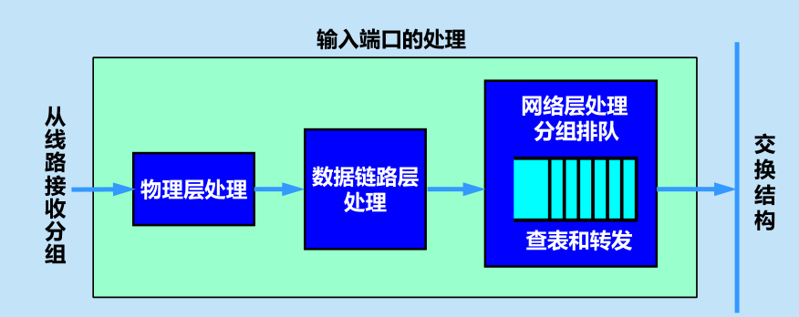

      **输入端口中的查找和转发功能在路由器的交换功能中是最重要的**

   3. 输出端口：分组首部的加装

      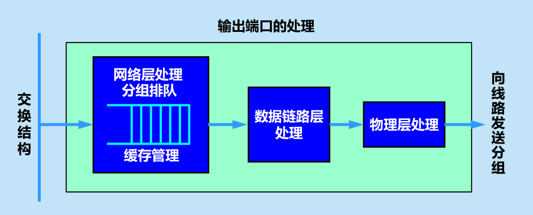

   > 这里的端口就是硬件接口

3. “转发”和“路由选择”的区别

   路由表是根据路由选择算法得出的。而转发表是从路由表得出的。

4. 分组丢弃：输入或输出队列产生溢出（处理分组的速率赶不上分组进入队列的速率）

## 7.IP多播

1. 目的：更好地支持一对多通信

2. 多播可大大节约网络资源：局域网具有硬件多播功能，**不需要路由器复制分组**

3. 多播地址：在多播数据报的**目的地址**写入的是**多播组的标识符（IP 地址中的 D 类地址）**

   > 只能用于目的地址，不能用于源地址

4. 多播数据报：使用 **D 类 IP 地址（多播地址）**作为目的地址；使用网际组管理协议 **IGMP**；**不产生 ICMP 差错报文**

5. 局域网的硬件多播

   原理为数据链路层的硬件多播，但要解决一个映射问题

   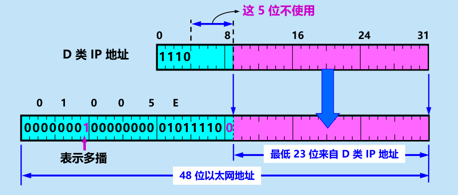

   >  由于多播 IP 地址与以太网硬件地址的映射关系不是唯一的，因此收到多播数据报的主机，还要**在 IP 层利用软件进行过滤**，把不是本主机要接收的数据报丢弃

6. 网际组管理协议 **IGMP** 和**多播路由选择协议**

   1. 目的

      1. IGMP:使路由器知道多播组成员的信息
      2. 把多播数据报用最小代价传送给所有的组成员

   2. IGMP

      1. 作用范围：本地局域网

         IGMP 协议是让连接在**本地**局域网上的**多播路由器**知道本局域网上是否有主机（严格讲，是主机上的某个进程）参加或退出了某个多播组。

         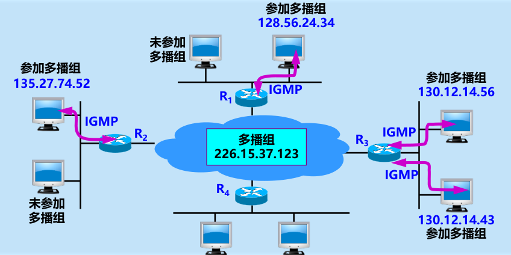

   3. **多播路由选择协议**在转发多播数据报时使用三种方法：
      (1) 洪泛与剪除

       	路由器收到多播数据报时，先检查它是否是从源点经最短路径传送来的（相同则选其中一条），是接收否丢弃

      ​	最后就得出了用来转发多播数据报的**多播转发树**

      ​	多播转发树上的某个路由器发现它的下游树枝（即叶节点方向）已没有该多播组的成员，就应把它和下游的树枝一起剪除

      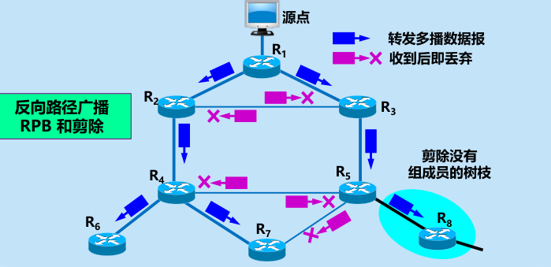

      (2) 隧道技术 (tunneling)
      (3) 基于核心的发现技术

## 8.VPN

本地地址——仅在机构内部使用的 IP 地址，可以由本机构自行分配，而不需要向互联网的管理机构申请。
全球地址——全球唯一的 IP 地址，必须向互联网的管理机构申请

问题：地址二义性

解决：专用地址。专用地址只能用作本地地址而不能用作全球地址。在互联网中的所有路由器，对目的地址是专用地址的数据报**一律不进行转发**

专用网络：采用这样的专用 IP 地址的互连网络称为专用互联网或本地互联网

虚拟专用网VPN：**利用公网**的互联网作为**本机构各专用网之间**的通信载体，这样的专用网又称为虚拟专用网VPN

- 隧道技术

- 数据都必须加密

- 基于 TCP/IP 协议

- 网络地址转换 NAT

  - 原理： NAT路由器，它至少有一个有效的外部全球IP地址

    所有使用本地地址的主机在和外界通信时，都要在 NAT 路由器上将其本地地址转换成全球 IP 地址，才能和互联网连接

    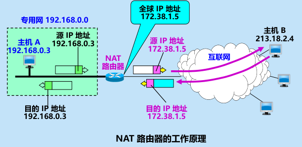

## 9 多协议标记交换 MPLS

MPLS 并没有取代 IP，而是作为一种 **IP 增强技术**，被广泛地应用在互联网中。

特点：

1. 支持面向连接的服务质量；
2. 支持流量工程，平衡网络负载；
3. 有效地支持虚拟专用网 VPN。

工作原理：同样是转发，但不查路由表，直接在数据链路层转发，快得多

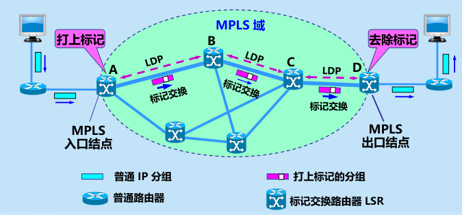

