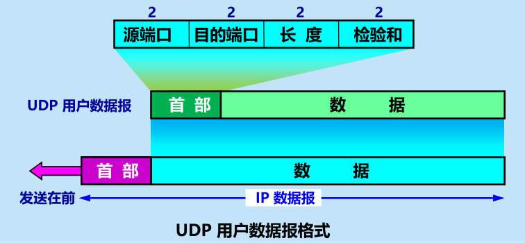
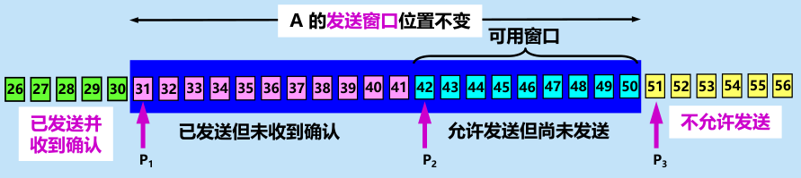

# 运输层

## 1.运输层协议概述

1. 进程之间的通信
   1. 运输层：主机中**进程**之间的通信（端到端），也就是说主机中的应用层通过运输层来传输数据
   
   2. IP层（网络层）：主机之间的通信
   
   3. 网络层与运输层的区别与联系：
   
      
   
2. 两个主要协议:
   1. UDP：不提供可靠交付，**不建立连接**，只在IP层上增加简单的差错检验和复用分用
   
   2. TCP：面向连接，提供**可靠交付**，相对UDP复杂很多
   
      
   
3. 运输层的端口：
   1. 端口是运输层与应用层的软件接口，每个端口对应一个具体的应用进程
   2. 端口号是某个具体主机中的进程的标识符，只具有**本地意义**
   3. 服务器端的端口号：熟知端口号、登记端口号
   4. 客户端的端口号：短暂端口号

## 2.用户数据报协议UDP

1. UDP特点
   1. 无连接
   2. 尽最大努力交付（不可靠交付）
   3. 面向报文：应用给什么发什么，不划分也不合并，就交给IP层
   4. 无拥塞控制
   5. 支持一对一、一对多、多对多
   6. 首部开销小

2. 首部格式

   

   1. 源端口

   2. 目的端口

   3. 长度

   4. 检验和：
      1. 伪首部：包含源和目的**IP地址**
      
      2. 首部：包含**端口号**（检验和部分全0）
      
      3. UDP**数据**部分
      
      4. UDP计算以上三者的四字节对齐的反码和，填入检验和，即检验了以上三者
      
         

## 3.传输控制协议TCP概述

1. TCP特点
   1. 面向连接：传输前要建立TCP连接
   2. 一条TCP连接只能有两个端点：每条TCP连接只能是点对点**（一对一）**
   3. 可靠交付
   4. 全双工通信
   5. 面向字节流：TCP将进程交下的数据看成无结构的一连串字节，所以应用层需要能从字节流中识别出数据部分的能力
2. TCP的连接
   1. 端点的套接字：socket = {IP地址：端口号}
   2. 套接字作为TCP连接的端点

## 4.可靠传输工作原理

非理想传输条件：信道有差错可能、接收方不一定来得及处理数据

可靠传输协议对策：数据有差错——重传；接收方跟不上速率——请求发送方降速

### 1.停止等待协议

> 实际上运输层不使用，帮助理解可靠传输

1. 无差错情况

   无差错情况下，发方A发一个分组就等待接收方B的确认ACK，**收到ACK后才发送下一个分组**

   

2. 出现差错

   - 分组**差错或丢失**

     接收方B：舍弃差错分组（也有可能分组丢失了）

     发送方A：**超时重传**

   - 分组**重复**

     发送方A：对发送分组编号，接收方可以舍弃重复分组

     接收方B：对确认分组编号，指示待确认的分组，发送方可以避免重发分组

   > 1、在发送完一个分组后，必须暂时保留已发送的分组的**副本**，以备重发。
   > 2、分组和确认分组都必须进行**编号**。
   >  3、超时计时器的**重传时间**应当比数据在分组传输的平均往返时间**更长一些。**

3. 确认丢失和确认迟到

   - 确认丢失：B发的确认丢失——A重传——B舍弃重复分组，并重发确认——A收到确认传下一个分组

     

   - 确认迟到：B发的确认迟迟不到——A重传——B舍弃重复分组，并重发确认——A收到确认传下一个分组——舍弃迟到的确认

     

     

4. 信道利用率
   $$
   U=\frac{T_D}{T_D+RTT+T_A}
   $$
   

5. 要点

   1. **停止等待**。发送方每次只发送一个分组。在收到确认后再发送下一个分组。
   2. **编号**。对发送的每个分组和确认都进行编号。
   3. **自动重传请求ARQ**。发送方为每个发送的分组设置一个超时计时器。若超时计时器超时，发送方会自动重传分组。
   4. **简单**，但**信道利用率太低**。

### 2.连续ARQ协议

1. 基本思想：
   ⚫ 发送方一次可以**发出多个分组**。
   ⚫ 使用**滑动窗口**协议控制发送方和接收方所能发送和接收的分组的数量和编号。
   ⚫ 每收到一个确认，发送方就把**发送窗口向前滑动**。
   ⚫ 接收方一般采用**累积确认**的方式。
   ⚫ 采用**回退N**（Go-Back-N）方法进行**重传**。

   > 发送方维持的发送窗口，它的意义是：位于发送窗口内的分组都可连续发送出去，而不需要等待对方的确认。这样，信道利用率就提高了。
   >
   > 发送方每收到一个确认，就把发送窗口向前滑动一个分组的位置

2. 工作原理

   1. 滑动窗口

      

   2. 累积确认

      对按序到达的最后一个分组发送确认，这样就表示：**到这个分组为止的所有分组都已正确收到了**。

   3. 回退N重传

      发方发送完窗口内数据，但接收的按序确认中断，需要再退回来重传已发送过的 N 个分组

3. 对比

## 5.TCP报文段首部格式

1. 源端口和目的端口——**TCP起终点**

2. 序号——该分组的编号，数值按**已发数据字节数递增**

3. 确认号——**期望**收到对方的下一个报文段的数据的第一个字节的序号（当ACK=1时有效）

4. 数据偏移——表明**首部长度**

5. 保留

6. 紧急URG

7. 确认ACK——1表明**确认号有效**

8. 推送——让接收方**立即向上交付接收缓存**

9. 复位

10. 同步

11. 终止

12. 窗口——接收方的**剩余缓存**，**接收方**来**限制发送窗口**的依据

13. 检验和——与UDP类似，更改协议字段和数据长度

14. 紧急指针

15. 选项

    1. MSS（Maximum Segment Size）——**避免**TCP报文过长使得**被IP层分片**（TCP报文大于MTU）导致丢包率上升

       MSS应该在避免TCP报文分片的情况下尽量大，提高网络利用率

    2. 窗口扩大——对于**时延带宽积很大**的信道（如卫星信道），原有的16位窗口可能不够用，可扩展到30位

    3. 时间戳——计算RTT、防止序号绕回

> 前14位为固定首部（20字节），选项长度可变可达40字节，填充部分保证TCP首部长度为4字节整数倍

## 6.TCP可靠传输实现

### 滑动窗口

> 实际的滑动窗口大小多为几千字节，足以放下许多报文段，事实上滑动窗口虽以字节为单位，但滑动还是以报文段为单位滑动的
>
> 滑动窗口的实现包括了编号、重传，可实现可靠传输

- 发送窗口

  发送窗口**范围**：发送窗口 = [确认号 , 确认号 + 窗口大小 -1]

  > 发送窗口动态变化，每接收到一个确认报文就变化一次，此处不考虑拥塞窗口的影响

  发送窗口**含义**：在收到接收方B的确认之前，可以连续发送窗口内的数据

  发送**窗口滑动**过程：

  - 根据

    

    发送窗口范围由确认报文决定。期望号 = 后沿指针，期望号 + 窗口大小-1 = 前沿指针

    > 前沿不允许向后，因为窗口内是连续发送的，接收方腾出缓存再确认即可

  - 在收到确认报文2前连续发送窗口内数据

    

    可用窗口：允许发送但未发送的内容。

    > 发送缓存只需保存发送窗口+部分不允许发送的内容，即粉 + 蓝 + 部分黄的内容，无需保存已确认的部分（绿）

  - 收到确认报文2更新发送窗口

- 接收窗口

  接收窗口**范围**：[EXP , EXP + 可用缓存-1 ]

  > 自定义：EXP = 按序到达的最后一个报文段的后一个,即期望报文段的第一个字节序号
  >
  > 可见接收窗口也是动态变化的，其后沿由按序到达的报文段决定，后沿由可用缓存与EXP共同决定

  接收窗口含义：目前只允许接收落入窗口内的数据

  接收**窗口滑动**过程：

  - 按序接收，累积确认，接收窗口持续推进

    > 确认报文会在接收缓存有足够空间时候才发送，比如腾出MTU或者接收缓存有一半空闲

  - 收到未按序到达数据，**累积确认中断**，**暂存**未按序到达的数据

    

    > 此时由于累积确认中断，B不向A发送确认了，等待A的重传
    >
    > 但A重传可能会重传发送窗口内的数据，为避免这种浪费，采用**选择重传**

  - 直至收到A重传数据，**累积确认恢复**，接收窗口继续推进

    

    A迟迟收不到确认报文，很快发送窗口就满了，无有效窗口，**超时重传**

    > 接收到重传数据，连带暂存数据，累积确认往前推进

- 发送与接收缓存

  

  

  -  **发送缓存**用来暂时存放：
    1. 发送应用程序传送给发送方 TCP 准备发送的数据；
    2. TCP 已发送出但尚未收到确认的数据。
  - **接收缓存**用来暂时存放：
    1. 按序到达的、但尚未被接收应用程序读取的数据；
    2. 不按序到达的数据。

### 超时重传时间RTO

1. 基本算法

   RTT_S为加权平均往返时间

   RTT_D为RTT的**偏差**的加权平均

   初始：
   $$
   RTT_{S_0}=RTT\text{样本}
   $$
   $$
   RTT_{D_0}=\frac{1}{2}RTT\text{样本}
   $$

   $$
   RTO_0=RTT_{S_0}+4\times RTT_{D_0}=3\times RTT\text{样本}
   $$

   迭代：
   $$
   RTO=RTT_S+4\times RTT_D
   $$

   $$
   RTT_S=\left( 1-\alpha \right) \times \text{旧的}RTT_s+\alpha\times \text{新的}RTT\text{样本,}\alpha =0.125
   $$

   $$
   RTT_D=\left( 1-\beta \right) \times \text{旧的}RTT_D+\beta \times|RTT_s-\text{新的}RTT\text{样本|，}\beta =0.25
   $$

2. Karn算法——区分有效和无效的样本

   1. 重传报文导致的RTT偏差

      

      由于重传报文与原报文完全一样，无法区分是迟到的确认报文还是对重传报文的确认

   2. Karn算法：一旦重传，就不考虑该报文的RTT样本

   3. 修正的Karn算法：一旦重传，RTO翻倍，不重传再按$RTO=RTT_S+4\times RTT_D$计算RTO

      > 这是因为原算法在重传时不更新RTO，明明是最应该调整RTO的时候，在RTT激增时，RTO会一直不更新。

### 选择重传SACK

1. 只传送缺少的数据而不重传已正确接收的数据

2. 接收方的确认报文指定**不需重传**部分

   1. 方法：确认报文首部使用SACK选项，选项字段写入不连续接收的字节块边界（不需要重传的部分）

      

      > 一个边界（序号）需4个字节，选项长度最多40字节，其中两字节用于标注SACK和选项长度，所以最多指明4个不连续字节块（4×（4×2）=32）

   2. 然而：不常用，大多数情况还是直接重传所有未确认数据

## 7.TCP流量控制

1. 目的：控制发方的发送速率，使得**接收方来得及接收**

2. 实现流量控制方法：**滑动窗口**

   窗口大小依据：空闲的接收缓存大小

   发送窗口 ≤ 接收窗口 

   

   - 零窗口探测

     当发方收到rwnd = 0后一直等非零窗口，超时发送零窗口探测报文段，打破死锁（可能确认报文丢失，收方也在等数据报文）

3. TCP传输效率

   所谓传输效率指：有用数据的占比。

   

   举例：为传一个字节而产生40×2字节的开销（40是TCP加IP首部，×2是还有确认报文），就十分低效。

   为提高传输效率，应当尽量接近MSS—最大TCP报文长度（不被IP层分片），这样可用充分利用报文段，相当于每辆车（报文段）都接近满载

   1. 三种发送报文段机制：

      1. 拼够人发车——缓存数据达到MSS发送
      2. 独享发车——发方应用进程push操作，直接发
      3. 到点发车——计时器到，发送数据(<MSS)

      > 其中MSS为最大TCP报文长度

   2. Nagle算法——发方攒够再发

      1. 原理

         

         > 收到确认再发是发报文段而不是发字节了，在等待确认时缓存已经积攒了不少数据，这样就提高了效率

      2. 综合了实时性（立即发第一个数据**字节**）和传输效率（缓存数据）

   3. 糊涂窗口综合征

      1. 每次仅发送一个字节或很少几个字节的确认，有效数据传输效率变得很低的现象。原因是接收缓存一有空间就回传确认。
      2. 让接收方**等待一段时间**，使得或者**接收缓存**已有足够空间容纳一个最长的报文段（**>MSS**），或者等到接收缓存已有**一半空闲**的空间。只要出现这两种情况之一，接收方就发出确认报文，并向发送方通知当前的窗口大小

## 8.TCP拥塞控制

1. 目的：控制发方速率，**缓解网络中的拥塞**
2. 原理：略

### TCP拥塞控制方法

> 此时不考虑接收缓存的影响，真正的发送窗口值 = Min (接收方窗口值，拥塞窗口值)

1. 慢开始

   拥塞窗口cwnd：发送窗口不能超过cwnd

   ​	初始值：1-2个SMSS

   > ​	其中SMSS就是发送方的MSS，最大发送TCP报文长度

   ​	增长速度：每接收到一个报文段(字节数为N)的确认，cwnd就增长 min{N,SMSS}

   慢开始门限ssthresh：慢开始时cwnd是**指数增长（每经过一个传输轮次/RTT，cwnd翻倍）**，需要门限来进行拥塞避免

2. 拥塞避免

   当cwnd超过慢开始门限ssthresh，每经过一个传输轮次/RTT，cwnd + 1——线性增长

   **当发生超时——拥塞标志，拥塞避免转为慢开始，同时**慢开始门限ssthresh减半

3. 快重传

   为避免个别报文丢失产生的拥塞误解，接收方识别到个别报文丢失时（如12345缺了2）要立即重复确认已收到的报文（收到345发对1的三个确认），这样发送方在**收到三个重复确认（3ACK）后，立即重传缺失报文**

   > 发送方收到三个连续重复确认，就知道缺失报文后的三个报文都没有丢失，信道没有完全拥塞，不需要慢开始，但这也是拥塞的征兆，所以折中选择了快恢复

4. 快恢复

   接收到 3ACK后，将慢开始门限ssthresh减半，并执行拥塞避免算法

   

   

### 主动队列管理AQM

1. 背景：路由器的队列管理，若采用尾部丢弃策略（FIFO满则丢弃队列尾部分组），会影响多条TCP连接导致执行慢开始算法（全局同步），这就使得网络突然通信量下降很多，然后又突然增大（同时执行慢开始）。

2. AQM（Active Queue Management）:不等队列满才舍弃尾部，而是有了某些拥塞征兆时，**主动丢弃分组以提醒**发送方减小发送速率。

   随机早期检测算法RED

   

   - 若平均队列长度小于最小门限 THmin，则将新到达的分组放入队列进行排队。
   2. 若平均队列长度超过最大门限 Thmax ，则将新到达的分组丢弃。
   - 若平均队列长度在最小门限 THmin 和最大门限 Thmax 之间，则按照某一概率 p 将新到达的分组丢弃。

   > 目前RED不再成为推荐标准，但也没有代替RED的算法

## 9.TCP运输连接管理

1. 运输连接阶段

   1. 建立连接
   2. 数据传送
   3. 连接释放

   > TCP 连接的管理就是使 TCP 连接的建立和释放都能正常地进行

2. 运输连接建立目的：

   1. 双方存在确知
   2. 协商参数——最大窗口、各种选项选择
   3. 运输实体资源分配——缓存

3. TCP 连接的建立采用**客户服务器方式**，客户主动发起连接，服务器等待连接建立

### 连接建立

**三报文握手**

> 采用三报文握手主要是为了防止**已失效的连接请求**报文段突然又传送到了，因而产生错误

1. 初始状态：客户服务器进程均处于关闭状态（**CLOSED**）

   

2. 服务器进程监听：服务器进程常开，被动打开连接，创建传输控制块TCB（**LISTEN**）

   

3. 客户进程主动请求：客户进程主动打开连接，创建传输控制块TCB；向服务器进程发送连接请求报文(**SYN-SENT**)

   

   同步报文段要将SYN置1，ACK置0，表示连接请求

   同步报文选择初始序列号x，但实际客户端发送的第一个数据字节为x+1,因为同步报文段要消耗一个序号；

   > 同步报文段消耗一个序号可能是因为，虽然同步报文段按TCP规定不能携带数据段，但“请求同步”本身就是一个信息，接收方需要对该信息进行确认，因而需要序号

4. 服务器进程收到请求，回传确认报文（**SYN-RCVD**）——第一次握手

   

   同步确认报文段要将SYN置1，ACK置1，表示连接接受

   同步确认报文同样选择一个初始序列号y，也要消耗一个序号；

5. 客户进程收到确认报文，回传确认报文（**ESTABLISHED**）——第二次握手

   

   该确认报文可以携带数据

6. 服务器接收到确认报文，TCP连接建立（**ESTABLISHED**）——第三次握手

   

   ​	第三次握手是为了避免**已失效的连接请求**报文段，在连接释放后突然又传送到了服务器，因而产生错误浪费服务器资源

   ​	若没有收到第三次握手，服务器也不会建立TCP连接，就可以节省下服务器资源。

   总过程：

   

### 连接释放

> 连接的释放是双方都可以提出的，一般是客户主动释放连接，也有客户端异常，服务器主动释放连接的情况

**保活计时器**（TCP主动释放连接）：用来防止在TCP连接出现长时期的空闲。 保活计时器 通常设置为2小时 。若服务器过了2小时还没有收到客户的信息，它就发送探测报文段。若发送了10个探测报文段（每一个相隔75秒）还没有响应，就假定客户出了故障，因而就终止该连接。

**四报文握手**

1.  客户端主动发起释放连接请求，发送连接释放报文段（**FIN-WAIT1**）

   

   A 的应用进程停止再发送数据，主动**关闭 TCP 连接**（不再发送数据），此时客户端**等待服务器的确认**

   > FIN = 1，表示该报文发送方无数据发送，要求终止连接；序列号为u，u = 发送过的数据最后一个序列号 + 1；

2. 服务器端收到连接释放报文段，回传确认报文段（**CLOSE-WAIT**）——第一次握手

   

   服务器端通知高层应用进程，从 A 到 B 这个方向的连接就释放了，TCP 连接处于**半关闭状态**，但是B 若发送数据，A 仍要接收（**等待服务器剩余数据传送**）

   > ACK = 1，ack = u + 1确认刚刚的释放连接请求

3. 客户端收到确认报文，等待服务器传输完数据后的连接释放报文段（**FIN-WAIT2**）——第二次握手

   

4. 服务器端传输完数据后，发送连接释放报文段

   

   ​	B 已经没有要向 A 发送的数据， 其应用进程就通知 TCP 释放连接，等待请求的确认（LAST-ACK）

   > FIN = 1，连接释放请求；seq = w 与 v不同，表示在上个过程中传输了一些字节；ACK =1,ack =  u+1

5. 客户端收到连接释放请求，回传确认，同时进入时间等待（**TIME-WAIT**）——第三次握手

   

   此处的TIME-WAIT是等待2MSL时间（最大报文寿命）

   - 确保LAST_ACK可以到达服务器，若B没有收到，A可以重传
   - 确保下一个连接状态中，没有已失效的旧的连接请求（与三握手连接请求形成双保险）

6. 服务器接收到确认报文，结束TCP连接——第四次握手

   

​	总过程

TCP有限状态机

