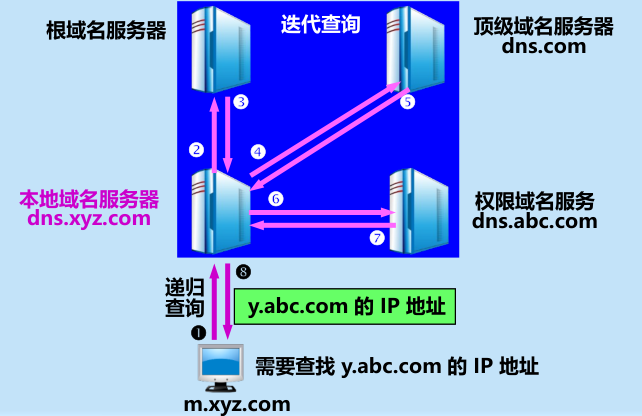

# 应用层

应用层协议：为了解决某一类应用问题的协议。

网络应用：通常包含客户端进程、服务器进程、应用层协议等，应用层协议通常是客户服务器进程间通信需要遵循的规则，是网络应用的一部分

> DNS、WWW、DHCP、SNMP都是网络应用，分别使用不同的协议
>
> 其中WWW使用HTTP协议，其余应用层协议与应用同名

## 1.域名系统DNS

DNS：解决域名解析IP问题，便于用户使用便于记忆和编辑的域名，同时不影响机器识别IP地址；

​	    分布式系统，保证域名解析的高效可行性

> 变长的域名和使用有助记忆的字符串，是为了便于人来使用。而 IP地址是定长的 32 位二进制数字则非常便于机器进行处理

1. 域名结构：

   1. 顶级域名：国家(cn、uk)、通用（com、net、org、edu、gov）、反向域名（arpa）
   2. 二级域名（由顶级域名对应国家/单位自行划分）：我国二级域名（行政区域、类别域名）
   3. 再往下划分也是按上一级域名的单位自行划分

   

2. 域名服务器

   1. 权限域名服务器管辖的范围为“区”：区 是 域 的子集

      > 这意味着，一个服务器可以合并某个域下的多个可连通的子域，但不可以合并不可连通的子域

      

      在这两个例子中，左边的abc.com中只有一个权限域名服务器**dns**.abc.com，区 = 域；右边的abc.com中有两个权限域名服务器，分别为**dns**.abc.com、dns.y.abc.com，管辖不同的范围，此时域名服务器**dns**.abc.com管辖的区 < 域abc.com

      > 请注意：域是一个逻辑概念，主要按组织单位分层次划分，域结构树上的节点也只是逻辑概念，如abc公司下属的x,y部门只是逻辑上的划分，但事实上x\y节点是不一定要有权限域名服务器的，也就是说可以合并x.abc.com和y.abc.com这两个子域
      >
      > 但是叶节点一定是对应一个主机IP的

   2. 四种域名服务器

      - 根域名服务器：本地解析不了时，找我，我帮你找域名对应的顶级域名服务器IP

      - 顶级域名服务器：找到我了，我帮你找域名对应IP（有的话）/下一级域名服务器IP

      - 权限域名服务器：一级级找到我了，我知道我管辖区的所有域名与IP对应关系，到我这就肯定能知道查询域名的IP了

        > 注：如果是像上图右边一样，dns.abc.com虽然是权限域名服务器（从外界查询肯定先问上他），但是他不知道abc.com全域的信息，就会把解析不了的域名转去dns.y.abc.com

      - 本地域名服务器（默认域名服务器）：累死我了，我就是个跑腿的，问来问去，这下我得把域名和IP暂时记下来（**高速缓存**两天），省得再问一遍

   3. 高速缓存：每个域名服务器都维护一个高速缓存，存放最近用过的名字以及从何处获得名字映射信息的记录

3. 域名解析过程

   1. 递归查询：主机向本地域名服务器查询时用递归查询，即本地域名服务器代理主机查询

   2. 迭代查询：本地域名服务器向根域名服务器的查询，即本地域名服务器重复查询

      

   

## 2.文件传输协议—略

## 3.万维网WWW

万维网WWW：万维网是**分布式超媒体 (hypermedia) 系统**，它是超文本(hypertext) 系统的扩充。

​			是一个大规模的、联机式的信息储藏所

> 万维网 WWW (World Wide Web) 并非某种特殊的计算机网络

> 如图，每个万维网站点都存放超文本/超媒体文档，文档可以链接到不同的站点存放的文档，

1. 万维网以**客户 - 服务器**方式工作

   -  **浏览器**就是在用户计算机上的**万维网客户程序**。万维网文档所驻留的计算机则运行服务器程序，因此这个计算机也称为万维网服务器
   - 客户程序向服务器程序发出请求，服务器程序向客户程序送回客户所要的万维网文档

2. 怎样标志分布在整个互联网上的万维网文档？——使用统一资源定位符 **URL** 

   

   

3. 用何协议实现万维网上各种超链的链接？——**HTTP协议**

4. 怎样使各种万维网文档都能在互联网上的各种计算机上显示出来，同时使用户清楚地知道在什么地方存在着超链？

   ——超文本标记语言 **HTML**

5. 怎样使用户能够很方便地找到所需的信息？——搜索工具（即**搜索引擎**）

### HTTP协议

1. 层次：HTTP 是**面向事务**的

2. 万维网的工作过程

   

   - 每个万维网网点都有一个**服务器进程**，它不断地**监听 TCP 的端口80**，以便发现是否有浏览器向它发出连接建立请求。
   -  一旦监听到连接建立请求并**建立了 TCP 连接之后**，**浏览器**就向万维网服务器**发出浏览某个页面的请求**，服务器接着就返**回所请求的页面**作为响应。
   -  最后，TCP 连接就被释放了。

3. HTTP 的主要特点

   1. HTTP 报文通常都使用 **TCP 连接传送**
   2. HTTP 协议本身也是**无连接的**
   3. HTTP协议是**无状态的**

4. HTTP演进

   1. HTTP1.0

      

      非持续连接：每请求一个文档就需要2RTT开销，必要时对同一个域名开启多个TCP连接，并行传输

   2. HTTP1.1

      持续连接：服务器响应后，仍然在一段时间内保持TCP连接，后续开销只需一个RTT

      缺点：空闲状态浪费了服务器资源；不能完全解决队头阻塞问题，在一个连接上还是只能串行传输数据，服务器可能会因为某个响应文档过大导致响应时间过长，甚至堵塞后续响应

      两种工作方法：

      - 非流水线：等响应再发请求
      - 流水线：不等响应，直接发请求

   3. HTTP2

      并行传输（时分复用，并行传输小的帧），解决HTTP1.1的服务器响应堵塞风险，实现真正的并行传输

5. 代理服务器（万维网高速缓存）

   > 类似于DNS本地域名服务器的高速缓存。

   原理：**将最近的一些请求和响应暂存在本地磁盘**。当与暂时存放的请求相同的新请求到达时，万维网高速缓存就把暂存
   的响应发送出去，而**不需要按 URL 的地址再去互联网访问该资源**。

   

   ​	可以大大减少对外通信量

   具体过程：

   1. 浏览器访问互联网的服务器时，要先**与校园网的高速缓存建立 TCP 连接**，并向高速缓存发出 HTTP 请求报文。
   2. 若高速缓存已经存放了所请求的对象，则将此对象放入 HTTP 响应报文中返回给浏览器
   3.  否则，高速缓存就代表发出请求的用户浏览器，与互联网上的源点服务器建立TCP 连接，并发送 HTTP 请求报文
   4. 源点服务器将所请求的对象放在HTTP 响应报文中返回给校园网的高速缓存。
   5. 高速缓存收到此对象后，先复制在其本地存储器中（为今后使用），然后再将该对象放在 HTTP 响应报文中，通过已建立的 TCP 连接，返回给请求该对象的浏览器

6. HTTP报文

   1. 两类

      1. 请求
      2. 响应

   2. 结构

      

      1. 请求报文三部分

         - 开始行：请求行。包括请求资源的**URL**以及HTTP**版本**和对应**操作**
         - 首部行：浏览器服务器信息
         - 主体：无

      2. 响应报文三部分：

         

         - 开始行：响应行。包括状态码（如404NOTFOUND）以及HTTP**版本**和解释状态码的简单短语

           > 1xx 表示**通知**信息的，如请求收到了或正在进行处理。
           >  2xx 表示**成功**，如接受或知道了。
           >  3xx 表示**重定向**，表示要完成请求还必须采取进一步的行动。
           > 4xx 表示**客户的差错**，如请求中有错误的语法或不能完成。
           > 5xx 表示**服务器的差错**，如服务器失效无法完成请求

         - 首部行：浏览器服务器信息

         - 主体

7.  Cookie： 表示在 HTTP 服务器和客户之间传递的状态信息

   使用 Cookie 的网站服务器为用户产生一个**唯一的识别码**。利用此识别码，**网站就能够跟踪该用户在该网站的活动**

### HTML文档

1.  超文本标记语言 HTML

   1. 定义了许多用于排版的命令（即标签）

   2. 链接的设置：每个链接都有一个起点和终点

      远程链接：超链的终点是其他网点上的页面。
       本地链接：超链指向本计算机中的某个文件

2. 动态万维网文档

   1. **静态文档**：是指该文档创作完毕后**就存放在万维网服务器中**，在被用户浏览的过程中，内容不会改变（准确说法应该是**在不同请求过程中，内容不变**）

   2. **动态文档**：是指**文档的内容**是在浏览器**访问万维网服务器时**才由应用程序**动态创建**

      > 主要差别体现在**服务器一端**，从浏览器的角度看，这两种文档并没有区别，反正都是请求一个文档，文档信息在浏览过程中不变

   3. 万维网服务器功能扩充

      为了实现动态文档的动态创建需要：

      1. 增加另一个应用程序：处理浏览器发来的数据，并创建动态文档

      2. 增加一个机制：使万维网服务器把浏览器发来的数据传送给这个应用程序，然后万维网服务器能够解释这个应用程序的输出，并向浏览器返回 HTML 文档

         > 即万维网服务器程序与创建动态文档的应用程序的交互接口——通用网关接口CGI

3.  活动万维网文档

   1. 把所有的工作都转移给**浏览器端**

   2.  每当浏览器请求一个活动文档时，服务器就返回一段**程序副本**在浏览器端运行，活动文档则由程序副本在客户端创建

      

      这样对浏览器和服务器来说，其实和静态文档没有区别，程序文件也是事先存放好不改变的，相当于浏览器向服务器请求一个静态程序文件

      区别在于：把动态页面的工作交给客户端，客户端运行传来的程序后，即可创建出交互式的动态页面，相比于服务器运行程序再持续推送给很多浏览器，减轻了很大的网络带宽压力

## 4.动态主机配置协议DHCP

DHCP：解决协议软件的**参数自动配置**问题。

问题描述：计算机上运行的许多协议软件（确保主机间数据传输的软件，如HTTP协议软件、TCP/IP协议软件等），需要配置其参数，一般来说，需要配置：

- IP 地址
- 子网掩码
- 默认路由器的 IP 地址
- 域名服务器的 IP 地址

1. 特点：提供了**即插即用连网** (plug-and-playnetworking) 的机制。

2. 工作方式：**客户服务器**方式，采用**请求/应答**方式工作

   1. **需要 IP 地址的主机**在启动时就向 DHCP 服务器**广播发送发现报文**（DHCPDISCOVER），这时该主机就成为 DHCP 客户

   2. 本地网络上所有主机都能收到此广播报文，但**只有 DHCP 服务器才回答此广播报文**

      > 目的地址全1的广播报文，路由器均不转发；与之类似的还有网络号固定，主机号全1的目的地址，仅在该网络号的子网广播

   3.  DHCP 服务器先在其数据库中查找该计算机的配置信息。**若找到，则返回找到的信息。若找不到，则从服务器的 IP 地址池 (addresspool) 中取一个地址分配给该计算机**。DHCP服务器的回答报文叫做**提供报文**（DHCPOFFER）

   4. DHCP **中继代理**：每个局域网都有一个DHCP中继代理，**配置了DHCP 服务器的 IP 地址信息**，收到主机发送的发现报文后，就以单播方式向DHCP 服务器转发此报文

   5. 采用UDP报文传输

3. 工作过程

   

   1. DHCP 服务器被动打开 UDP 端口 67，等待客户端发来的报文

   2. DHCP 客户从 UDP 端口 68发送 DHCP **发现报文** DHCPDISCOVER

   3. 凡收到 DHCP 发现报文的 DHCP 服务器都发出 DHCP 提供报文 DHCPOFFER，因此**DHCP 客户可能收到多个 DHCP 提供报文**

   4. DHCP 客户从几个 DHCP 服务器中**选择其中的一个**，并向所选择的 DHCP 服务器**发送 DHCP 请求报文 DHCPREQUEST**

   5.  被选择的 DHCP 服务器发送**确认报文DHCPACK**，进入已**绑定状态**，并可开始使用得到的**临时 IP 地址**了

      > DHCP 客户现在要根据服务器提供的租用期 T 设置两个计时器 T1 和 T2，它们的超时时间分别是 0.5T和 0.875T。当超时时间到就要请求更新租用期

   6. 租用期过了一半（T1 时间到），DHCP 发送**请求报文 DHCPREQUEST，要求更新租用期**

   7. DHCP 服务器若同意，则发回**确认报文DHCPACK**。DHCP 客户**得到了新的租用期，重新设置计时器**

   8. DHCP 服务器若不同意，则发回**否认报 DHCPNACK**，这时 DHCP 客户必须立即停止使用原来的 IP 地址，而**必须重新申请 IP** 地址

      > 若 DHCP 服务器不响应步骤 ❻ 的请求报文 DHCPREQUEST，则在租用期过了 87.5% 时，DHCP 客户必须重新发送请求报文DHCPREQUEST（重复步骤 ❻），然后又继续后面的步骤

   9. DHCP 客户可随时**提前终止**服务器所提供的租用期，这时只需向 DHCP 服务器发送**释放报文 DHCPRELEASE** 即可

4. 租用期：租用期的数值应由 DHCP 服务器自己决定，DHCP分配的IP是临时IP

## 5.简单网络管理协议SNMP

SNMP：管理网络主机、协调网络资源maybe

1. 基本概念

   1. 管理站：即管理器，运行管理程序的主机
   2. 被管设备：本地网络中，被管理站管理的设备（对象命名树的子树）
   3. 网络管理员：人
   4. 管理程序：管理站中的客户程序
   5. 网络管理代理程序（代理）：被管设备中的服务器程序
   6. 网络管理协议

2. SNMP基本原理：尽可能简单，对原有对象的影响尽可能小

3. SNMP组成部分：

   1. 管理信息结构SMI：定义了命名对象和类型的规则，以及编码规则。——建立规则

      > 什么是int，什么是float，变量名如何命名、类型有多少位

   2. 管理信息库MIB：在被管对象的实体中创建命名对象，规定类型。——说明变量

      > 在本地声明变量int a; float b;

   3. SNMP本身：定义管理器和代理之间的通信方式，如分组格式、修改变量的规则。——完成网管动作

      > 变量赋值 a = 10; b = 1.0

4. SMI

   1. 功能：

      1. 被管对象应**怎样命名**；
      2. 用来存储被管对象的**数据类型**有哪些种；
      3. 在网络上传送的管理数据应**如何编码**

   2. 被管对象**命名**：位于**对象命名树**

   3. 被管对象的**数据类型**：**简单类型**和**结构化类型**

   4. 编码规则 BER

      

5. MIB

   

6. SNMP

   1. SNMP 的操作只有**两种基本的管理功能**：
      1. “读”操作，用 get 报文来检测各被管对象的状况；
      2. “写”操作，用 set 报文来改变各被管对象的状况。
   2. 通过**探询**操作来实现上述功能
      1. 探询操作 —— SNMP 管理进程**定时**向被管理设备周期性地**发送探询信息**。
      2. 好处：
         1. 可使**系统相对简单**。
         2. 能**限制**通过网络所产生的管理信息的**通信量**
      3. 缺点：
         1. **不够灵活**，而且所能管理的设备数目不能太多。
         2. **开销也较大**
   3.  捕捉“事件”
      1. 陷阱：允许不经过询问就能发送某些信息。这种信息称为陷阱（某些突发事件）
      2. 过滤：代理只向管理进程报告达到某些门限值的事件（陷阱）
      3. 过滤的好处是：
         1. 仅在严重事件发生时才发送陷阱；
         2. 陷阱信息很简单且所需字节数很少。
   4. 特点：**使用无连接的 UDP**
